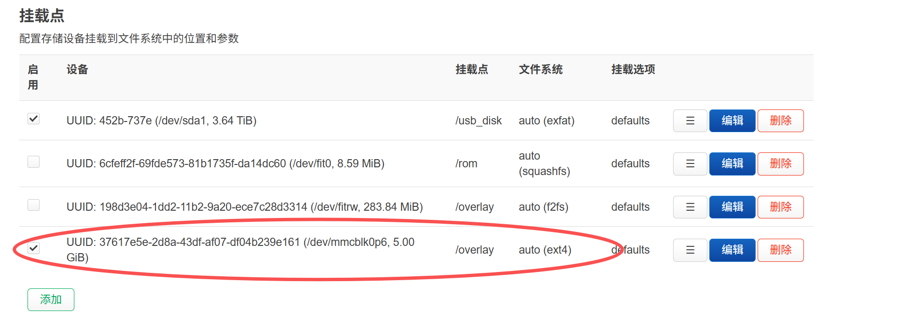

## 流程

安装相关软件
 
    opkg install lsblk fdisk cfdisk

浏览分区列表

    root@RAX3000M:~# lsblk
    NAME          MAJ:MIN RM   SIZE RO TYPE MOUNTPOINTS
    sda             8:0    0   3.6T  0 disk
    └─sda1          8:1    0   3.6T  0 part /mnt/sda1
    mmcblk0       179:0    0  57.6G  0 disk
    ├─mmcblk0p1   179:1    0   512K  0 part
    ├─mmcblk0p2   179:2    0     2M  0 part
    ├─mmcblk0p3   179:3    0     4M  0 part
    ├─mmcblk0p4   179:4    0    32M  0 part
    ├─mmcblk0p5   179:5    0   300M  0 part
    └─mmcblk0p128 259:0    0     4M  0 part
    mmcblk0boot0  179:8    0     4M  1 disk
    mmcblk0boot1  179:16   0     4M  1 disk
    fit0          259:1    0   8.6M  1 disk /rom
    fitrw         259:2    0 283.8M  0 disk /overlay

打开分区软件

    cfdisk /dev/mmcblk0

创建一个5GB的分区

    root@RAX3000M:~# lsblk
    NAME          MAJ:MIN RM   SIZE RO TYPE MOUNTPOINTS
    sda             8:0    0   3.6T  0 disk
    └─sda1          8:1    0   3.6T  0 part /mnt/sda1
    mmcblk0       179:0    0  57.6G  0 disk
    ├─mmcblk0p1   179:1    0   512K  0 part
    ├─mmcblk0p2   179:2    0     2M  0 part
    ├─mmcblk0p3   179:3    0     4M  0 part
    ├─mmcblk0p4   179:4    0    32M  0 part
    ├─mmcblk0p5   179:5    0   300M  0 part
    ├─mmcblk0p6   179:6    0     5G  0 part #这个是刚新建的
    └─mmcblk0p128 259:0    0     4M  0 part
    mmcblk0boot0  179:8    0     4M  1 disk
    mmcblk0boot1  179:16   0     4M  1 disk
    fit0          259:1    0   8.6M  1 disk /rom
    fitrw         259:2    0 283.8M  0 disk /overlay

格式化新分区

    mkfs.ext4 /dev/mmcblk0p6

挂载到临时目录复制原来的文件

    mkdir -p /mnt/new_overlay
    mount /dev/mmcblk0p6 /mnt/new_overlay
    tar -C /overlay -cvf - . | tar -C /mnt/new_overlay -xf -

在web界面 '系统->挂载点' 中将这个5G的分区挂载为/overlay

复制新的挂载配置文件到新的overlay中去

    cp -p /etc/config/fstab /mnt/new_overlay/upper/etc/config/fstab

卸载临时挂载

    umount /mnt/new_overlay
