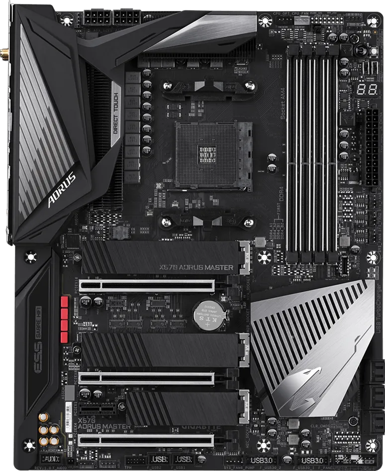
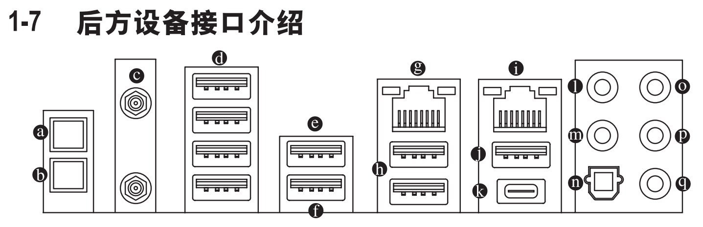
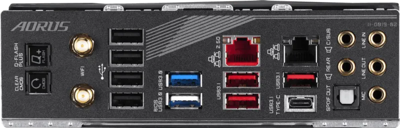

[手册 PDF](mb_manual_x570-aorus-master_1002_sc.pdf)

## 相关图片

| {width=400} | {width=400} |

## USB控制器

- `PCI bus(总线) 10, device(设备) 0, function(功能) 3`
  - 后方接口 `(d*4)` : USB 2.0/1.1规格
  - 主板内置: `英特尔(R) 无线 Bluetooth(R)`

- `PCI bus 16, device 0, function 3`
  - port: 1 ~ 4(2.0/1.1) 对应 5 ~ 8(3.0)
  - 后方接口 `(e)` : USB 3.1 Gen 1规格，并可兼容于USB 2.0规格
  - 后方接口 `(f)` : USB 3.1 Gen 1规格，并可兼容于USB 2.0规格,Q-Flash Plus
  - 后方接口 `(h*2)` : USB 3.1 Gen 2/Gen 1规格

